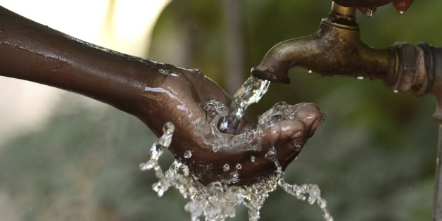

## **TANZANIA WATER WELLS PROJECT**

Authors: Winfred Kabuya

Period : May 2023

## Project Overview

This project aims to develop a classifier that predicts the condition of water wells in Tanzania based on various factors such as the type of pump, installation date, and other relevant information. The target audience for this classifier could be an NGO focused on identifying wells in need of repair or the Government of Tanzania seeking insights to inform future well construction decisions.

### Business Problem 

The business problem addressed  is the lack of access to clean water in Tanzania. Over 57 million people in Tanzania face difficulties in obtaining safe water, often resorting to collecting it from distant and unsafe sources. While progress has been made in establishing water points, many of them require repair or have become non-functional.

The objectives of the project are as follows:

    - Develop a predictive model to classify the condition of water wells in Tanzania.
    - Identify patterns and factors contributing to non-functional wells.
    - Assist NGOs and the Tanzanian government in effectively allocating resources for well repair and construction initiatives.
    - Improve access to clean and safe water for the population of Tanzania.

The available datasets from Taarifa and the Tanzanian Ministry of Water consist of information about waterpoints in Tanzania. The datasets include the test set values, which are the independent variables requiring predictions, training set labels indicating the dependent variable (status_group) for each row in the training set values, and training set values representing the independent variables for training.

The ultimate goal is to predict the operating condition of each waterpoint based on various features, with the status_group serving as the target variable indicating the current operating condition of the waterpoint.

## Data Understanding

 - test_set_values represent the independent variables (features) for the test set, where predictions need to be made.
 - training_set_labels represent the dependent variable (status_group) for each row in the training set values. It represents the current operating condition of the waterpoints.
 - training_set_values: Represent the independent variables (features) for the training set, used to train the predictive model.

## Modelling and Evaluation

We tested the different models and based on the accuracy score we settled on the One-hot Coding classifier where:

    - Precision: Measures the proportion of correctly predicted instances out of the total predicted instances for each class. Higher precision indicated fewer **false positives**.The model has good precision for all classes.
    - Recall: Measures the proportion of correctly predicted instances out of the total actual instances for each class. Higher recall indicated fewer **false negatives**. The model has reasonably good recall for all classes.
    - F1-score: Is the harmonic mean of precision and recall, providing a balance between the two metrics. The F1-scores are relatively high for all classes, indicating good overall performance.

Overall, the model achieved an accuracy of 80.74%, which means that it correctly predicted the class for approximately 80.74% of the instances in the validation set. The macro-averaged F1-score is also 80.74%, indicating consistent performance across all classes. The weighted average F1-score is also 80.74%, considering the class imbalance in the dataset.

## Recommendations

  - Machine learning (ML) techniques are valuable for analyzing large and complex datasets like the Tanzania well dataset, allowing for the identification of patterns and relationships that may be overlooked through traditional data analysis methods.

  - Data cleaning is crucial to ensure data quality before applying ML algorithms. Removing unnecessary variables and addressing missing values or outliers can streamline the analysis.

  - ML algorithms should be chosen based on the dataset characteristics and analysis goals. In the case of the Tanzania well dataset, One hot coding,RandomClassification,confusion matrix and KNN were employed, with One-hot coding the highest accuracy score.

  - Class imbalance can be addressed using techniques like oversampling or undersampling to balance the class distribution in the training data. This helps improve the model's performance on minority classes.

  - Feature engineering involves creating new features or transformations to provide more predictive power. Exploring additional relevant features or external data sources can enhance the model's accuracy.

  - Hyperparameter tuning optimizes the model's hyperparameters to improve performance. Grid search or random search can be used to find the best configuration.

  - Cross-validation provides a more robust estimate of the model's performance by evaluating it on multiple data splits. It helps assess consistency and reduces overfitting risks.

  - Collecting more data, especially targeting the class imbalance issue, can improve the model's ability to generalize and make accurate predictions.

  - Deepening domain knowledge and exploring the data further can provide insights for feature selection, data quality issues, and understanding the factors influencing the target variable.

## Conclusions

- Collect More Data: Especially for the minority classes, to provide a more representative and balanced dataset for training the model.

- Improve the performance of the model by combining data preprocessing techniques, feature engineering, model selection, and careful evaluation.

- Regular iteration and experimentation with different approaches are essential to achieve better results in predicting the status of water points in Tanzania.
